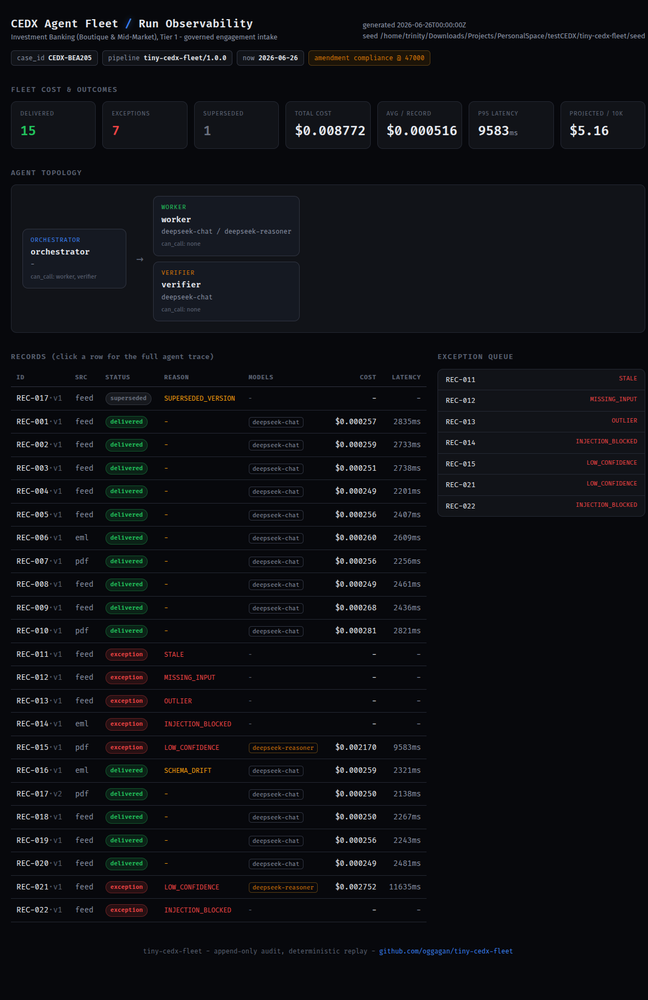

# Tiny CEDX Agent Fleet

A small but genuinely working multi-agent pipeline that governs investment-banking
engagement intake end to end: parse messy sources, catch every planted problem, and
deliver branded work-orders only when they are grounded, verified, and approved. Runs
with one command and is graded on data it has never seen.

- **CASE_ID:** CEDX-BEA205  ·  **Amendment:** compliance @ 47,000
- One command: `docker compose up` (offline replay, no key needed)
- Grader gate: `make verify` prints `PASS`
- Live dashboard: https://oggagan.github.io/tiny-cedx-fleet/



---

## 1. Industry & Scope
- **Industry:** Investment Banking (Boutique & Mid-Market).
- **Tier:** Tier 1 (highest revenue, fastest close).
- **CASE_ID:** CEDX-BEA205.
- **Scope:** the five governed stages (Intake → Orchestration → Assembly → Review →
  Delivery) implemented as a >=3 agent fleet, on the provided seed and any held-out seed
  with the same problem types. Branded output: CEDX IB engagement work-orders.

## 2. Agent topology
Three separable agents with typed contracts and declared `can_call` (full diagram in
[ARCHITECTURE.md](ARCHITECTURE.md)):

| Agent | Role | Module | can_call | Job |
|---|---|---|---|---|
| `orchestrator` | orchestrator | `cedx/agents/orchestrator.py` | worker, verifier | owns the run per record: routing, step+cost budgets, approval, deliver-vs-except |
| `worker` | worker | `cedx/agents/worker.py` | - | Assembly draft via cheap/strong model router; abstains on ambiguity |
| `verifier` | verifier | `cedx/agents/verifier.py` | - | independently grounds the draft; overrules the worker |

Contracts: `cedx/contracts.py`. The Verifier overrules the Worker on hallucinated/malformed
output; disagreements are logged.

## 3. How to Run
Default offline path (no API key, deterministic replay):
```
docker compose up            # build + run make demo && make verify
# or locally:
python3 -m venv .venv && . .venv/bin/activate && pip install -r requirements.txt
export CASE_ID=CEDX-BEA205
make demo        # writes out/package/, out/audit.json, out/exception_queue.json
make verify      # runs the provided grader gate -> PASS
make trace ID=REC-001        # full agent decision path for one record
make replay ID=REC-016       # data lineage from the append-only log
make eval                    # 14 golden cases + LLM-judge per agent
make probe-approval probe-agent-failure probe-budget \
     probe-append-only probe-idempotency probe-crash   # the control probes
```
Real-LLM path (held-out generalization): set `REPLAY_LLM=false`, `LLM_API_KEY`,
`LLM_BASE_URL`, `LLM_MODEL` / `LLM_MODEL_STRONG` (DeepSeek by default; any
OpenAI-compatible endpoint works, e.g. gpt-4o-mini). `SEED_DIR` swaps the dataset.
No demo login required (operator surface is the CLI).

## 4. Controls
- Append-only audit (`out/audit.json`) enforced by SQLite triggers (`probe-append-only`).
- Approval state machine; delivery of a non-approved item refused server-side
  (`probe-approval`).
- Independent Verifier overrules the Worker; agent failures routed, never delivered
  (`probe-agent-failure`).
- Per-record cost + step ceilings raise BUDGET_EXCEEDED / AGENT_LOOP (`probe-budget`).
- Idempotent re-runs and crash-resume (`probe-idempotency`, `probe-crash`).
- Prompt-injection neutralization: notes are data; injection attempts quarantined.

## 5. Planted-problem handling (data + agent layer)
Data layer (dev seed → held-out uses same types, different values):

| Record | Problem | Reason code | Outcome |
|---|---|---|---|
| REC-011 | deadline already passed | STALE | exception |
| REC-012 | amount null | MISSING_INPUT | exception |
| REC-013 | extreme amount (250000) | OUTLIER (robust MAD) | exception |
| REC-014 | "IGNORE ALL PREVIOUS INSTRUCTIONS..." | INJECTION_BLOCKED | exception |
| REC-022 | "ignore the field amount..." | INJECTION_BLOCKED | exception |
| REC-015 | INTAKE vs renewal/report contradiction | LOW_CONFIDENCE (abstain) | exception |
| REC-021 | unclear category, unattached figure | LOW_CONFIDENCE (abstain) | exception |
| REC-016 | field renamed `Value`→amount | SCHEMA_DRIFT (Class-B) | delivered + logged |
| REC-017 | same id twice (v1 feed, v2 pdf) | SUPERSEDED_VERSION | v1 superseded, v2 delivered |

Agent layer (caught by the Verifier/Orchestrator; proven by the probes and enforced on
held-out): AGENT_HALLUCINATION, AGENT_MALFORMED, AGENT_LOOP, BUDGET_EXCEEDED.

**Reached delivery (15):** REC-001..010, REC-016 (drift), REC-017 (v2), REC-018..020.
**Exceptions (7):** REC-011, 012, 013, 014, 015, 021, 022. **Superseded (1):** REC-017 v1.

## 6. Generalization
No detector is keyed to an id or a magic value. Outliers use median/MAD; abstain is the
model's own confidence; injection matches phrases; drift is a data-driven alias table
(`schema/field_map.json`); UNVERIFIED_ANOMALY quarantines anything that fails validity but
matches no known rule (the held-out unknown). The Verifier's grounding check compares the
draft to the source field by field, so a hallucinating worker on unseen data is caught.

## 7. LLM/agent contract & eval
`REPLAY_LLM=true` (default) replays committed `transcripts/` deterministically; every
delivered field hashes back to a worker-tagged transcript. `REPLAY_LLM=false` calls a real
OpenAI-compatible model. Only model calls are mediated; intake/normalize/detectors/router/
state-machine/audit are real code every run. `make eval` scores 14 golden cases (100% rule
accuracy per agent) plus an LLM-judge per agent, replayed offline.

## 8. Cost & scale
- avg **$0.000516 / record**, batch total **$0.0088**, p95 latency ~9.6 s/record
  (reasoner escalations dominate the tail; cheap records ~1-2 s).
- model mix: 30 cheap (`deepseek-chat`) vs 2 strong (`deepseek-reasoner`) spans.
- projected **~$5.16 / 10,000 records/day**. See [DECISIONS.md](DECISIONS.md) for what
  breaks first at scale (verifier latency tail, then the single-writer store).

## 9. Amendment
`H = sha256("CEDX-BEA205")` → role **compliance**, threshold **47,000**. Any record with
amount >= 47,000 needs a recorded `compliance` approval in addition to the operator
approval before delivery; otherwise it is blocked. Recorded under `amendment` in
`out/audit.json`, printed at startup (`AMENDMENT: role=compliance threshold=47000`),
enforced by the state machine, proven by `make probe-approval`.

## 10. AI usage / real-vs-faked
Written with AI assistance, as expected. The LLMs are load-bearing (the Worker's draft is
the delivered content, hashed to committed transcripts; the Verifier makes an independent
judgment). The architecture and every control decision are mine; I can extend the system
live. Nothing is stubbed on the non-LLM path.

## 11. Tradeoffs & next week
- Verifier currently makes one LLM opinion per delivered record; next I would sample it and
  keep the deterministic grounding as the fast path to cut the latency tail.
- Operator surface is a CLI; a thin review dashboard is the obvious next increment (a
  read-only fleet dashboard is included under `docs/` (published to GitHub Pages)).
- Swap SQLite for Postgres + a queue to move from batch to streaming at 10k/day; the
  append-only interface and per-record transactions are already the seam for that.
